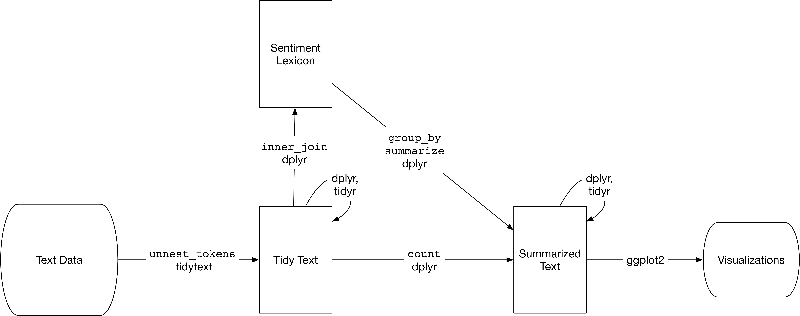

```{r misc_function, eval=T, echo=F, warnings=F}

    rm(list = ls())   
    graphics.off()
    options(scipen = 4, digits = 6)
    options(stringsAsFactors = FALSE)
    knitr::opts_chunk$set(echo = F, eval=T, cache=T, tidy.opts=list(width.cutoff=53),
                tidy=T, include=FALSE, message=F, warning=F)
    library.warn <- library
    library <- function(package, help, pos = 2, lib.loc = NULL, character.only = FALSE,
                        logical.return = FALSE, warn.conflicts = FALSE, quietly = TRUE,
                        verbose = getOption("verbose")) {
       if (!character.only) {
          package <- as.character(substitute(package))
       }
       suppressPackageStartupMessages(library.warn(
          package, help, pos, lib.loc, character.only = TRUE,
          logical.return, warn.conflicts, quietly, verbose))}
    library(ggplot2)
    library(ggExtra)
    library(MASS)
    library(dplyr)
    library(tidyr)
    library(tidytext)
    library(janeaustenr)
    library(stringr)
    library(gutenbergr)
    library(scales)
    library(wordcloud)

```

## Today's Agenda

- Two objectives today
    + introduce text mining tools
    + introduce command line tools
- Homework 8

## Text mining in R  

Fantastic online book from which much of this material originated:  
<http://tidytextmining.com/tidytext.html#contrasting-tidy-text-with-other-data-structures>

Remember the tidy concepts?  

- Each variable is a column  
- Each observation is a row  
- Each type of observational unit is a table

Let's use those concepts in a text mining framework.

## Tidy text

Make a table with one token per row.

Token: meaninful unit of text  
    - word  
    - sentence  
    - email  
Tokenization: process of splitting text into tokens

How do we get from raw text to tokens in tidy format??  

dplyr, tidyr

How do we look at the data?  

ggplot2, broom

Others.

tm, quanteda, Nulty

## Tidy vs other text mining

- String: simple character vectors
- Corpus: raw strings plus metadata  
- Document-term matrix: sparse matrix of documents vs terms

## First text

```{r eval=T, echo=T, include=T}

text <- c("Because I could not stop for Death -",
          "He kindly stopped for me -",
          "The Carriage held but just Ourselves -",
          "and Immortality")

text
```

## Tidy'ing ... 

```{r eval=T, echo=T, include=T}

    text_df <- data_frame(line = 1:4, text = text)
    text_df

```

Enter tydytext

```{r eval=T, echo=T, include=T}

text_df %>%
  unnest_tokens(word, text)

```

## Basic workflow in text analysis | from tidy perspective

<http://tidytextmining.com/>

```{r, out.height="400px",out.width="650px",eval=T, echo=F, include=T}
    knitr::include_graphics("tidyflow-ch-1.png")
```

## Tidy'ing something bigger  

```{r eval=T, echo=T, include=T}

original_books <- austen_books() %>%
  group_by(book) %>%
  mutate(linenumber = row_number(),
         chapter = cumsum(str_detect(text, regex("^chapter [\\divxlc]",
                                                 ignore_case = TRUE)))) %>%
  ungroup()

original_books

```

## Tokenize it

```{r eval=T, echo=T, include=T}

tidy_books <- original_books %>%
  unnest_tokens(word, text)

tidy_books

```

## Stop words

Google "stop words"

```{r eval=F, echo=T, include=T}

data(stop_words)

tidy_books %>%
  count(word, sort = TRUE) 

tidy_books <- tidy_books %>%
  anti_join(stop_words)

tidy_books %>%
  count(word, sort = TRUE) 

```

## Basic graphic
```{r eval=T, echo=T, include=T}
tidy_books %>%
  count(word, sort = TRUE) %>%
  filter(n > 4500) %>%
  mutate(word = reorder(word, n)) %>%
  ggplot(aes(word, n)) +
  geom_col() +
  xlab(NULL) +
  coord_flip()
```

## More complex graphics

```{r eval=T, echo=F, include=T}

hgwells <- gutenberg_download(c(35, 36, 5230, 159))
tidy_hgwells <- hgwells %>%
  unnest_tokens(word, text) %>%
  anti_join(stop_words)

bronte <- gutenberg_download(c(1260, 768, 969, 9182, 767))
tidy_bronte <- bronte %>%
  unnest_tokens(word, text) %>%
  anti_join(stop_words)

frequency <- bind_rows(mutate(tidy_bronte, author = "Brontë Sisters"),
                       mutate(tidy_hgwells, author = "H.G. Wells"), 
                       mutate(tidy_books, author = "Jane Austen")) %>% 
  mutate(word = str_extract(word, "[a-z']+")) %>%
  count(author, word) %>%
  group_by(author) %>%
  mutate(proportion = n / sum(n)) %>% 
  select(-n) %>% 
  spread(author, proportion) %>% 
  gather(author, proportion, `Brontë Sisters`:`H.G. Wells`)

# expect a warning about rows with missing values being removed
ggplot(frequency, aes(x = proportion, y = `Jane Austen`, color = abs(`Jane Austen` - proportion))) +
  geom_abline(color = "gray40", lty = 2) +
  geom_jitter(alpha = 0.1, size = 2.5, width = 0.3, height = 0.3) +
  geom_text(aes(label = word), check_overlap = TRUE, vjust = 1.5) +
  scale_x_log10(labels = percent_format()) +
  scale_y_log10(labels = percent_format()) +
  scale_color_gradient(limits = c(0, 0.001), low = "darkslategray4", high = "gray75") +
  facet_wrap(~author, ncol = 2) +
  theme(legend.position="none") +
  labs(y = "Jane Austen", x = NULL)

```

## Sentiment analysis

Again, awesome writeup in R book. <http://tidytextmining.com/>


```{r, out.height="400px",out.width="650px",eval=T, echo=F, include=T}
    
```


## Sentiments

```{r eval=T, echo=T, include=T}

sentiments

```

## Word clouds

```{r eval=T, echo=T, include=T}

tidy_books %>%
  anti_join(stop_words) %>%
  count(word) %>%
  with(wordcloud(word, n, max.words = 100))

```

## Bash/sed/awk

command line stuff

We will hit this harder in both R via gsub and python (beautifulsoup).


## Homework 8
