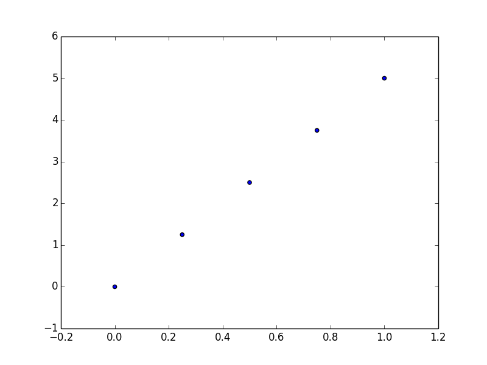
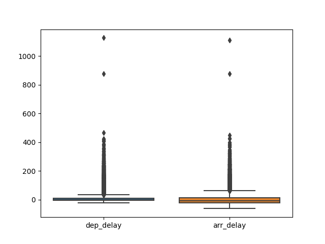

```{r misc_function, eval=T, echo=F, warnings=F}

    rm(list = ls())   
    graphics.off()
    options(scipen = 4, digits = 6)
    options(stringsAsFactors = FALSE)
    knitr::opts_chunk$set(echo = F, eval=T, cache=T, tidy.opts=list(width.cutoff=53),
                tidy=T, include=FALSE, message=F, warning=F)
    library.warn <- library
    library <- function(package, help, pos = 2, lib.loc = NULL, character.only = FALSE,
                        logical.return = FALSE, warn.conflicts = FALSE, quietly = TRUE,
                        verbose = getOption("verbose")) {
       if (!character.only) {
          package <- as.character(substitute(package))
       }
       suppressPackageStartupMessages(library.warn(
          package, help, pos, lib.loc, character.only = TRUE,
          logical.return, warn.conflicts, quietly, verbose))}
    library(ggplot2)
    library(ggExtra)
    library(MASS)
    library(dplyr)
    library(tidyr)
    library(tidytext)
    library(janeaustenr)
    library(stringr)
    library(gutenbergr)
    library(scales)
    library(wordcloud)
    library(feather)

```

## Today's Agenda

- Two objectives today
    + summarize parallel R  
    + show how to use Python in Rnotebooks  
    + text mining in Python  
    + start thinking about final "project"  
- Homework 9

## Parallel R summary

Sometimes we find that we need our code to run faster and need to do this ourself in R.  

```{r eval=F, tidy=F, echo=T, include=T}
#dopar to calculate the sum of squares total for y
cl <- makeCluster(detectCores()-1)
registerDoParallel(cl)
time_ssc <- system.time({
  ss_dopar <- foreach(i=1:length(y), .combine = "+") %dopar% {
    sum((y[i] - ybar)^2)
  }})

#parSapply to calculate the sum of squares total for y
ss_sap <- function(i){
  return((i - ybar)^2)
}
clusterExport(cl, varlist=c("ss_sap","ybar"))
time_ssd <- system.time({
  ss_parS <- sum(parSapply(cl, y, function(i) ss_sap(i), USE.NAMES = F, simplify = T))
})
stopCluster(cl)
```


## Faster with work
There are other options beyond the scope of this class:  

* Rcpp  
* GPU computing in R  
* Code in Fortran/C and write an interface to this code

## Sometimes faster/easier is to use a different language

The real goal is to go from data to results as quickly and reproducibly as possible creating as sound an analysis as the data allows.  Factoring in your time to write the code, sometimes this means you work in a different language because the facilities for the perfect analysis are more advanced/easier/faster outside of R.

How do we do this??  

One option is to use RNotebooks.

## Notebooks 

Note that the idea of notebooks is not new and R is a late comer in this arena.  The support for multiple languages in any of the Notbeeks is not seamless *yet (ever?)*, BUT, there are advantages.

Today we will introduce Python and some bash in RNotebooks.

## Python

<http://rmarkdown.rstudio.com/authoring_knitr_engines.html#python>

`{python echo=F, include=T, eval=T}`  
`x = 'hello, python world!'`  
`print(x.split(' '))`  


```{python echo=F, include=T, eval=T}
x = 'hello, python world!'
print(x.split(' '))
```

What just happened??

We told the RNotebook interpreter to use the local Python interpreter to perform a string split on the given sentence based on the space character and then print the result.  Cool, not a lot of extra effort here.

## Bash

I can do stuff in bash too, even manipulate files ...  
`{bash echo=T, eval=T, include=T}`  
`ls -lah | head -n 4`  
`ls -lah > dir_listing.txt`  
`cat dir_listing.txt | head -n 4`  

```{bash echo=T, eval=T, include=T}
ls -lah | head -n 4
ls -lah > dir_listing.txt
cat dir_listing.txt | head -n 4 
```

## Functionality

Ok, so this is all very cool, what can't we do (currently):  

* directly reference variables defined in one interpreter flavor from another  
    Why?  The code is being interpreted and called in an external process.  
    This is kinda important, so how do we deal with it??  
    Temp files.  Blah.  At least there is a package for it to make it faster...
    
* create visuals using the external process and have them directly incorporate
    Why? read *external process*  
    OK, so how do you do it?? Have the external process create a png/jpg/etc.
    This is how the internals work anyway.

## Python example code
`{python echo=T, eval=F, include=T, engine.path="/Users/rsettlag/miniconda3/bin/python"}`  
`import pandas; import feather; import csv`  
`# Read flights data and select flights to O'Hare`  
`flights = pandas.read_csv("flights.csv")`  
`flights = flights[flights['dest'] == "ORD"]`  
`# Select carrier and delay columns and drop rows with missing values`  
`flights = flights[['carrier', 'dep_delay', 'arr_delay']]`  
`flights = flights.dropna()`  
`print(flights[:5])`  
`# Write to feather file for reading from R`  
`feather.write_dataframe(flights, "flights.feather")`  
`##<---- I had some trouble with this on the R side`  
`## but in the process of implimenting the csv to get around it`  
`## discovered the real issue was that I didn't know where I was in dir str`  
`with open("flights2.csv", "w", newline='') as csv_file:`  
`        writer = csv.writer(csv_file, delimiter=',')`  
`        for line in flights:`  
`            writer.writerow(line)`  

```{python echo=F, eval=T, include=F, engine.path="/Users/rsettlag/miniconda3/bin/python"}
import pandas
import feather
import csv

# Read flights data and select flights to O'Hare
flights = pandas.read_csv("flights.csv")
flights = flights[flights['dest'] == "ORD"]

# Select carrier and delay columns and drop rows with missing values
flights = flights[['carrier', 'dep_delay', 'arr_delay']]
flights = flights.dropna()
print(flights[:5])

# Write to feather file for reading from R    
feather.write_dataframe(flights, "flights.feather")
## or as a csv
with open("flights2.csv", "w", newline='') as csv_file:
        writer = csv.writer(csv_file, delimiter=',')
        for line in flights:
            writer.writerow(line)
```

## And back to R
```{r eval=T, include=T, echo=T, out.height="250px",out.width="200px"}
library(feather) 
library(ggplot2)

# Read from feather and plot
flights <- read_feather(path = "./flights.feather")

#
p <- ggplot(flights, aes(carrier, arr_delay)) + geom_point() + geom_jitter()
p
```

## And what if we wanted to use Python to make the plot?

If I were better at python, I could make the plot more similar, but, for now...

```{python, eval=T, echo=T, include=T, engine.path="/Users/rsettlag/miniconda3/bin/python"}
import pandas as pd
import numpy as np
from matplotlib import pyplot as plt
import seaborn as sns

# Read flights data and select flights to O'Hare
flights = pd.read_csv("flights.csv")
flights = flights[flights['dest'] == "ORD"]

# Select carrier and delay columns and drop rows with missing values
flights = flights[['carrier', 'dep_delay', 'arr_delay']]
flights = flights.dropna()
temp = flights.drop(['carrier'], axis=1)

sns.boxplot(data=temp)
plt.savefig("planes2.png")
```
## Sad planes plot

```{r, out.height="550px",out.width="500px",eval=T, echo=F, include=T}
    
```

## Text mining in R  

Fantastic online book from which much of this material originated:  
<http://tidytextmining.com/tidytext.html#contrasting-tidy-text-with-other-data-structures>

Remember the tidy concepts?  

- Each variable is a column  
- Each observation is a row  
- Each type of observational unit is a table

Let's use those concepts in a text mining framework.

## Tidy text

Make a table with one token per row.

Token: meaninful unit of text  
    - word  
    - sentence  
    - email  
Tokenization: process of splitting text into tokens

How do we get from raw text to tokens in tidy format??  

dplyr, tidyr

How do we look at the data?  

ggplot2, broom

Others.

tm, quanteda, Nulty

## Tidy vs other text mining

- String: simple character vectors
- Corpus: raw strings plus metadata  
- Document-term matrix: sparse matrix of documents vs terms

## First text

```{r eval=T, echo=T, include=T}

text <- c("Because I could not stop for Death -",
          "He kindly stopped for me -",
          "The Carriage held but just Ourselves -",
          "and Immortality")

text
```

## Tidy'ing, tokenizing, 

```{r eval=T, echo=T, include=T}

original_books <- austen_books() %>%
  group_by(book) %>%
  mutate(linenumber = row_number(),
         chapter = cumsum(str_detect(text, regex("^chapter [\\divxlc]",
                                                 ignore_case = TRUE)))) %>%
  ungroup()

#original_books

tidy_books <- original_books %>%
  unnest_tokens(word, text)

tidy_books

# remove stop words

data(stop_words)

tidy_books %>%
  count(word, sort = TRUE) 

tidy_books <- tidy_books %>%
  anti_join(stop_words)

tidy_books %>%
  count(word, sort = TRUE) 

```


## Word clouds

```{r eval=T, echo=T, include=T}

tidy_books %>%
  anti_join(stop_words) %>%
  count(word) %>%
  with(wordcloud(word, n, max.words = 100))

```

## Python text mining

In my opinion, text mining is currently more natural and easier to accomplish in python.  The reason:

1. packages  
    beautifulsoup, and a bazillion others  
2. lists, dicts, and tuples  

List -- we know what that is from R  
Dict -- dictionary, essentially a lookup table    
Tuples -- essentially lists, but faster, immutable and can be used as keys on dictionaries  


## Quick text mine example

Ripped directly from the simple.py here:  
<https://github.com/amueller/word_cloud/blob/master/examples/simple.py>

```{python, eval=T, echo=T, include=T, engine.path="/Users/rsettlag/miniconda3/bin/python"}
from os import path
from wordcloud import WordCloud
import matplotlib.pyplot as plt

# Read the whole text.

text = open('constitution.txt').read()

# Generate a word cloud image
wordcloud = WordCloud().generate(text)

# Display the generated image:
# the matplotlib way:

plt.imshow(wordcloud, interpolation='bilinear')
plt.axis("off")

# lower max_font_size
wordcloud = WordCloud(max_font_size=40).generate(text)
plt.figure()
plt.imshow(wordcloud, interpolation="bilinear")
plt.axis("off")

plt.savefig("constitution.png")
```
## Constitution as a word cloud

```{r, out.height="550px",out.width="500px",eval=T, echo=F, include=T}
    
```

## Homework 9
